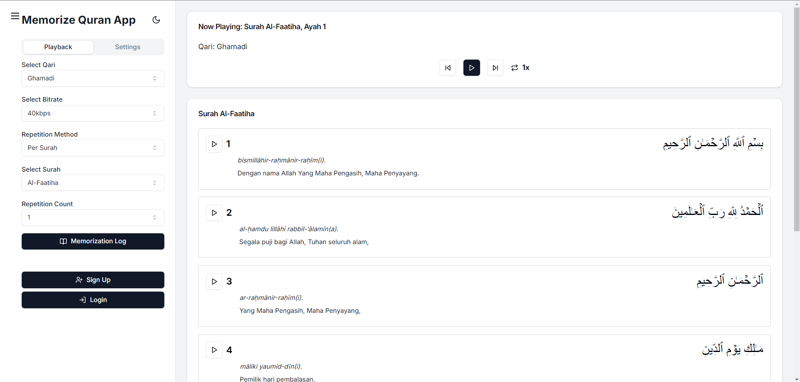
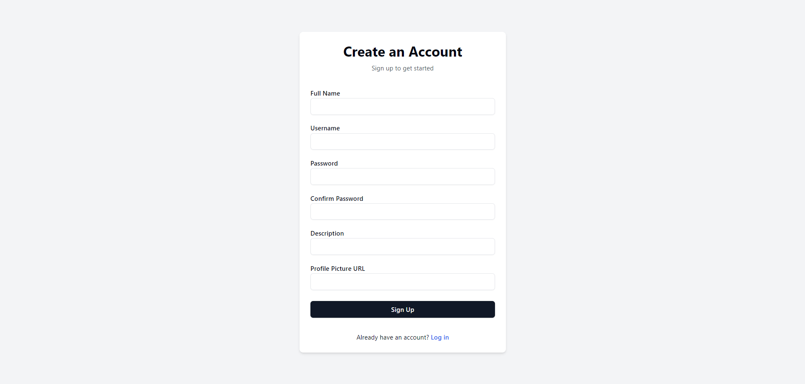
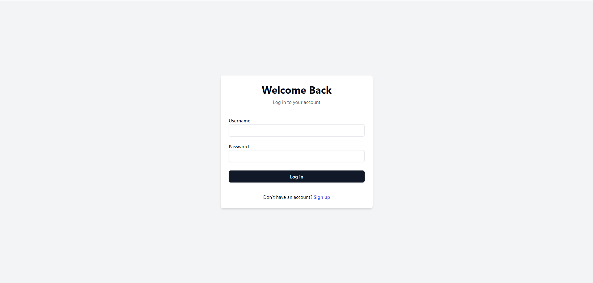
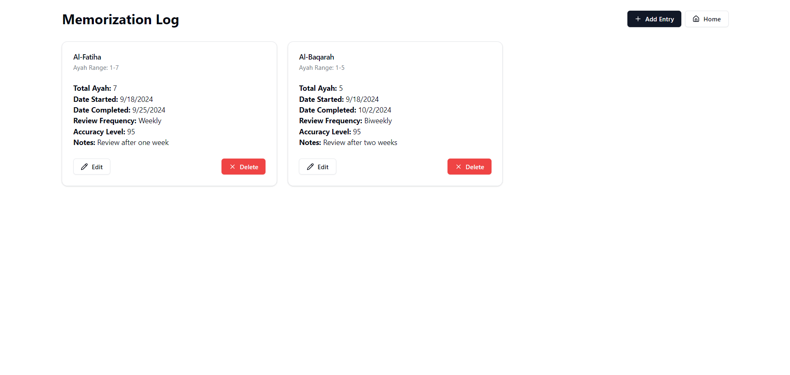
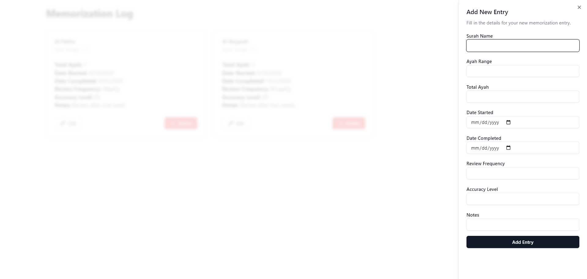

# Quran Memorization App

## Background
The Quran, revered as the ultimate guidance for Muslims, offers divine instructions on how to live a righteous and fulfilling life. For many Muslims, memorizing the Quran is not only a spiritual pursuit but also a means of internalizing this guidance. By memorizing its verses, they can carry the Quran within their minds and hearts, ensuring they have access to its wisdom at all times.

One of the most effective ways to memorize the Quran is through listening, which reflects how the Quran was originally revealed and transmitted by the Prophet Muhammad (peace be upon him) to his companions (Sahabah). Listening is a passive yet powerful method that requires minimal effort and can be done almost anywhere, making it especially appealing in our fast-paced modern lives. Through repetition, these auditory experiences imprint themselves in long-term memory, reinforcing both comprehension and retention of the sacred text.

With advancements in technology, accessing and interacting with the Quran has become easier than ever. The Quran Memorization App leverages these advancements to provide a seamless and accessible experience for users on various devices, including mobile phones. By offering customizable repetition methods and recitation options, it empowers Muslims to memorize the Quran at their own pace and convenience, wherever they are.

## Overview

The Quran Memorization App is a comprehensive tool designed to assist users in memorizing and studying the Quran. It offers a range of features to enhance the learning experience, including customizable recitation playback, translation options, and progress tracking.

## Features

### 1. Customizable Quran Recitation

- **Multiple Qaris**: Choose from a selection of renowned Quran reciters.
- **Repetition Methods**: 
  - Per Page
  - Per Juz (Chapter)
  - Per Surah
  - Custom Range
- **Adjustable Repetition**: Set the number of repetitions for verses or ranges.

### 2. Interactive Quran Text

- **Arabic Script**: View the Quran in its original Arabic text.
- **Transliteration**: Option to display transliterated text for non-Arabic speakers.
- **Translation**: Read translations in multiple languages.

### 3. Playback Controls

- Play, stop, skip forward, and backward.

### 4. Memorization Aids

- **Progress Tracking**: Keep track of memorized verses and chapters.

### 5. Customizable Display

- **Dark Mode**: Toggle between light and dark themes for comfortable reading.
- **Mushaf Types**: Choose from different Quran script styles.

### 6. User Accounts

- Create personal accounts to save progress and settings.
- Log memorization sessions and track improvement over time.

### 7. Memorization Log

- Record and review memorization progress.
- Add notes and set review frequencies for memorized portions.

### 8. Responsive Design

- Seamless experience across desktop and mobile devices.

## Technical Details

- Built with React and Next.js for a fast, modern web application experience.
- Utilizes server-side rendering for improved performance.
- Implements user authentication for personalized experiences.
- Responsive design using Tailwind CSS for a mobile-friendly interface.

### 1. Interaction With Backend
The backend was written in Golang
- The BE repository: https://github.com/radityafijarp/be-quran-app-final-project

### 2. Data Sources

Our Quran Memorization App utilizes various APIs and resources to provide a comprehensive Quranic study experience:

#### Quran Text and Translations

1. **Arabic Text and Basic Info**: 
   - API: `https://equran.id/api/v2/surat/${surahNumber}`
   - Provides Arabic text, transliteration, and Indonesian translation.

2. **English Translation**: 
   - API: `https://api.alquran.cloud/v1/surah/${surahNumber}/en.asad`
   - Offers English translation by Muhammad Asad.

3. **Page-based Quran Data**: 
   - API: `https://api.alquran.cloud/v1/page/${pageNumber}`
   - Fetches ayahs by page number for the "per ayah" view mode.

4. **Individual Ayah Translations**: 
   - API: `https://quran-api-id.vercel.app/surahs/${surahNumber}/ayahs/${ayahNumber}`
   - Used for Bahasa Indonesia translations of specific ayahs.

#### Audio Recitations

- Source: EveryAyah.com
- URL Structure: `https://everyayah.com/data/${reciterFolder}/${paddedSurahNumber}${paddedAyahNumber}.mp3`
- Offers various reciters, selectable by the user.

#### Mushaf (Quran Page) Images

- Sourced from multiple providers based on the selected Mushaf type.
- Configuration for different Mushaf types is stored locally in `mushafTypes.json`.

#### Additional Data

- List of Surahs: Fetched from API or stored locally.
- Reciter (Qari) List: Likely stored locally or in a configuration file.

This diverse set of data sources allows our app to provide a rich, customizable experience for Quran study and memorization. Users can access various translations, audio recitations, and visual representations of the Quran, catering to different learning preferences and needs.

## User Interface Dokumentation
### Main Page

### Signup Page

### Login Page

#### Dummy User Credentials
You can use the following dummy user accounts for testing login:
1. John Doe
    - Username: john_doe
    - Password: password123

2. Jane Doe
    - Username: jane_doe
    - Password: password456

### Memorization Log Page

### Memorization Log Form

## Getting Started

1. Clone the repository
2. Install dependencies: `npm install`
3. Run the development server: `npm run dev`
4. Open [http://localhost:3000](http://localhost:3000) in your browser
5. Don't forget to run the BE server first.

